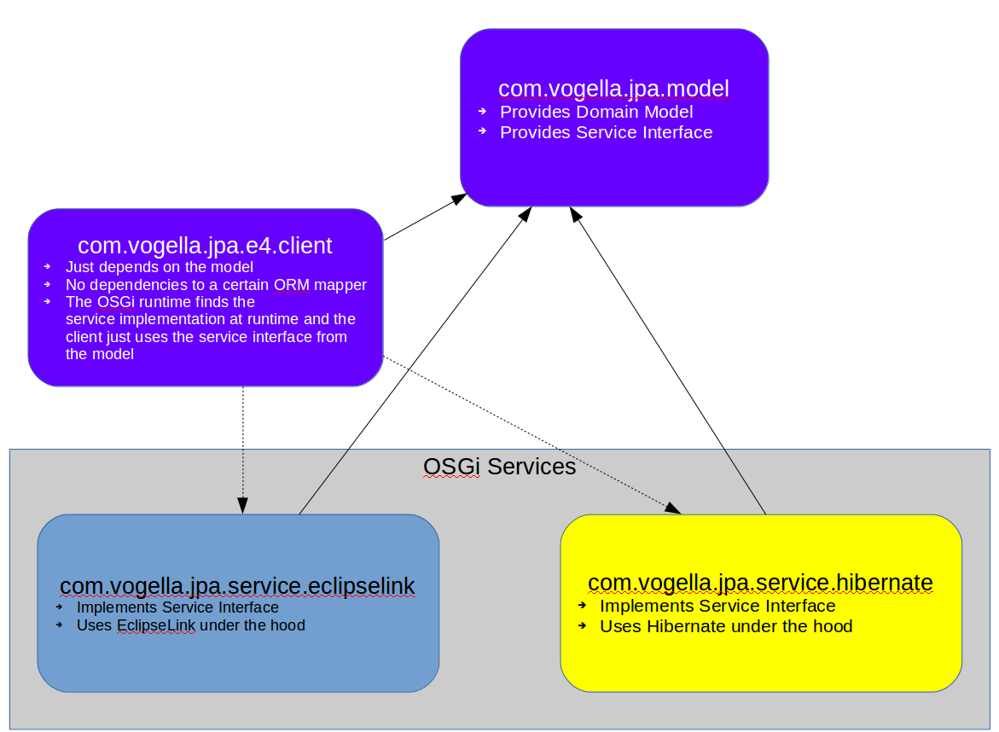

= Hibernate and EclipseLink in an OSGi Runtime and Eclipse 4

This repo shows how to use JPA in an OSGi environment and with Eclipse 4.

It provides products for both EclipseLink and Hibernate.

== Building and running the projects

[source, console]
----
cd com.vogella.jpa
./mvnw clean verify
----

After the successful build you can navigate to either the _/home/simon/git/com.vogella.jpa/com.vogella.jpa.product.eclipselink/target/products/vogella-jpa-eclipselink/***your OS***/***your ws***/***your arch***/vogella-jpa-eclipselink_ or _/com.vogella.jpa/com.vogella.jpa.product.hibernate/target/products/vogella-jpa-hibernate/***your OS***/***your ws***/***your arch***/vogella-jpa-hibernate_ and run the _vogella-jpa-eclipselink_ or _vogella-jpa-hibernate_ runnable.

== Architecture

The _com.vogella.jpa.e4.client_ bundle, which contains the Eclipse 4 application and implicitly uses EclipseLink or Hibernate is completely decoupled from the underlying ORM mapper.

== Hibernate vs. EclipseLink

I do not want to compare these two JPA implementations, but just mention that it is easier to include EclipseLink into a project, which uses an OSGi runtime, e.g., Eclipse, because for Hibernate it was still necessary to add the `Eclipse-BuddyPolicy: registered` instruction in the models _MANIFEST.MF_ file and to register the _com.vogella.jpa.service.eclipselink_ project as buddy (`Eclipse-RegisterBuddy: com.vogella.jpa.model`).

TIP
====
See https://wiki.eclipse.org/Context_Class_Loader_Enhancements for further information.
====

== Contributing

Feedback is highly appreciated and pull requests are appreciated even more.

So please feel free to ask for enhancements or offer pull requests for missing features.

